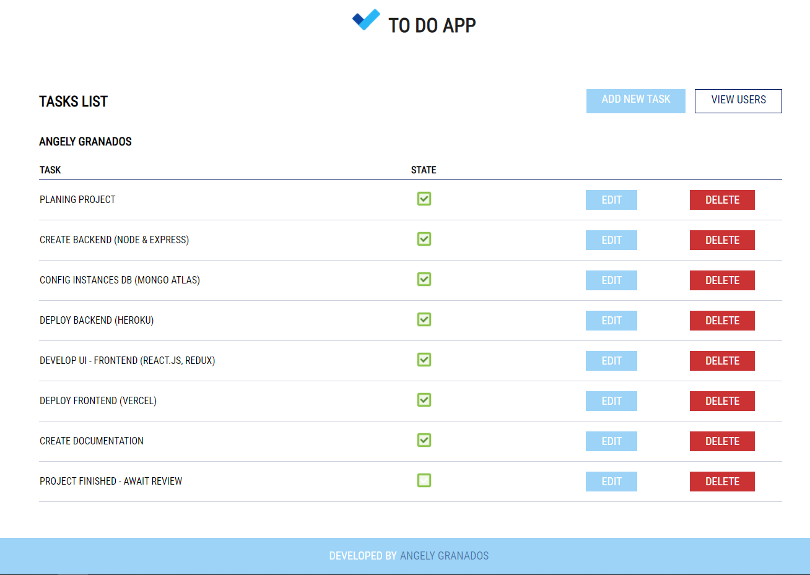
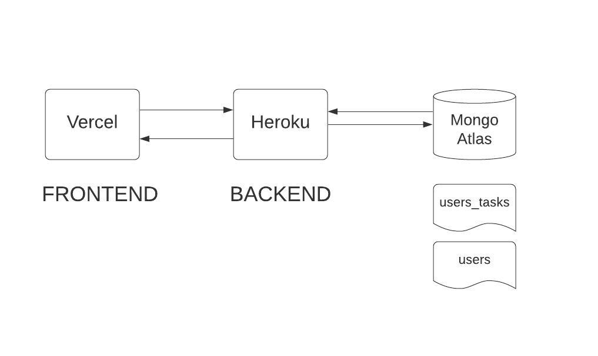

# To Do App ✔️

Web app that allows the user **_create_**, **_edit_** and **_delete_** users and manage their tasks.

<a href="https://todo.angelygranados.com/" target="_blank">To Do App</a>
 
<a href="https://github.com/angelygranados/to_do_app_frontend" target="_blank">Frontend Code</a>

 

## Architecture Diagram

## Available Scripts

In the project backend directory, you can run:

### `npm install`

Install all the dependencies

### `npm run dev`

Runs the app in the development mode. 
Open [http://localhost:3000](http://localhost:3000) to view it in the browser.

The page will reload if you make edits. 
You will also see any lint errors in the console.

### `npm start`

Runs the app in production mode.

## Dependencies

- cors: ^2.8.5
- dotenv: ^8.2.0
- express: ^4.17.1
- mongodb: ^3.6.2

### devDependencies

- eslint: ^7.11.0
- eslint-config-prettier: ^6.13.0
- eslint-plugin-prettier: ^3.1.4
- husky: ^4.3.0
- lint-staged: ^10.4.2
- nodemon: ^2.0.6
- prettier: ^2.1.2
